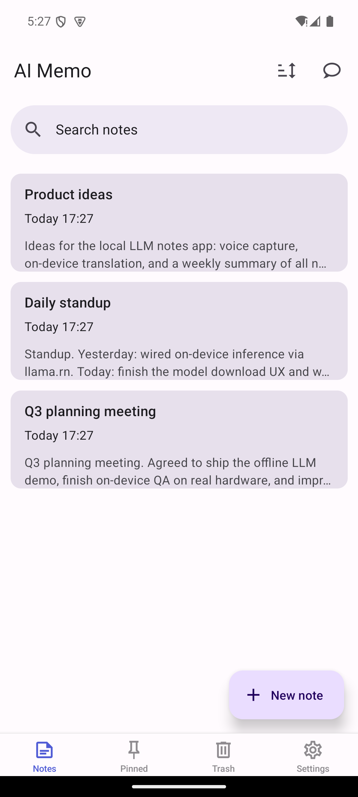
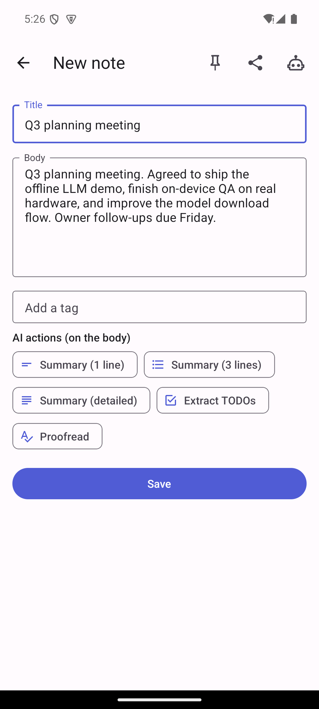
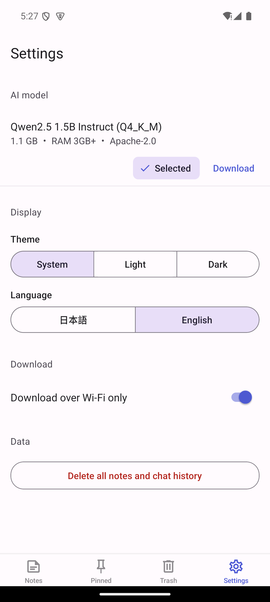

# react-native-local-llm-notes

> React Native から **iOS・Android で“ローカルLLM”を動かす**デモ。すべての AI
> 機能が**端末内（オンデバイス）**で動作し、完全オフラインで使えます。

[English README → `README.md`](README.md)

これは、React Native アプリでオンデバイス生成AIを実装するための**動作するデモ／
リファレンス**です。モデル（[Qwen 2.5 / Llama 3.2 の GGUF](#モデルとライセンス)）は
[llama.rn](https://github.com/mybigday/llama.rn)（llama.cpp バインディング）経由で
**端末内で実行**され、メモが端末の外に出ることはなく、モデルDL後はネットワーク
不要で動きます。

Expo ではなく **Bare React Native（CLI）＋新アーキテクチャ**（TurboModules/Fabric）
構成です（ローカルLLMにネイティブモジュールが必要なため）。

## このデモで示すこと

- 🧠 **端末内LLM推論**を iOS・Android 双方で（要約・翻訳・校正・トーン変換・
  続きを書く・チャット）— `llama.rn` 経由
- 🔒 **オフライン＆プライバシー** — サーバ無し・テレメトリ無し。テキストは端末内
- 📱 **同一コードで両OS** — Android エミュレータ（実機内生成まで確認）と iOS
  シミュレータでビルド・動作確認済み
- 🧩 **クリーンな設計** — 単一の `LlmEngine` インターフェースの背後に、純粋で
  フレームワーク非依存・ユニットテスト済みのコア（端末なしでAIロジックを検証可）
- 📥 **OS連携** — 共有受信（Android `ACTION_SEND` / iOS Share Extension）、
  ディープリンク（`ainote://`）、多言語（English / 日本語）

アプリの表示名は **「AI Memo」**。本リポジトリはそのデモプロジェクトです。

## スクリーンショット

| メモ一覧 | メモへのAIアクション | 設定・モデル |
|---------|--------------------|-------------|
|  |  |  |

## 機能

- **メモ** — 作成/編集/検索/タグ/ピン留め/並び替え、**ゴミ箱**（復元・元に戻す）、
  カード長押しのクイック操作
- **AIアクション**（すべて端末内）: 1行/3行/詳細の**要約**、**TODO抽出**、
  **校正・リライト**、**翻訳**（英↔日）、**トーン変換**（敬体/カジュアル）、
  **続きを書く**、**タイトル自動生成**
- **ストリーミング出力**（トークン逐次表示）＋トークン上限到達の通知。結果を
  元メモへ反映/追記、または新規メモとして保存
- **チャット** — 履歴を端末内に保存するローカルアシスタント
- **共有受信** — 他アプリの共有メニューからメモ追加
- **モデル管理** — GGUF モデルの DL/選択/削除
- **設定** — モデル・テーマ（ライト/ダーク/システム）・言語・データ削除

## 技術スタック

React Native 0.76（Bare CLI・新アーキ）・`llama.rn`（llama.cpp）・
react-native-paper（Material 3）・react-navigation（native-stack + bottom-tabs）・
react-native-fs・AsyncStorage・TypeScript・Jest + testing-library。

## アーキテクチャ

**純粋でフレームワーク非依存のコア**を React Native／ネイティブ層から分離し、
端末やLLMが無くてもビジネスロジックを完全にユニットテストできます。

```
src/
  core/                 # 純粋なTypeScript（RN非依存・ユニットテスト対象）
    llm/                # LlmEngineインターフェース、プロンプト、出力パース、タスク
    notes/              # NoteStore（CRUD/ゴミ箱/ピン）、検索・並び替え、整形
    settings/           # SettingsStore
    chat/               # ChatStore（履歴の永続化）
    models/             # モデルカタログ + ダウンロード状態管理
    storage/            # KeyValueStorageポート + インメモリ実装
  app/                  # React Native UI（paper + react-navigation）
    screens/            # メモ / エディタ / AI結果 / チャット / 設定 / ゴミ箱
    components/         # 表示部品（StreamingResult, ChatBubble）
    services/           # ストアとエンジンを束ねるコンテキスト
    navigation/         # ルートスタック + ボトムタブ
    i18n.ts             # en/ja の文字列表 + useT() フック
  native/               # 端末専用アダプタ（llama.rn）※テスト対象外
tests/                  # コアのJestユニットテスト（+ tests/app は RNTL）
```

要となる接合点は `LlmEngine` インターフェース（`src/core/llm/types.ts`）です。
端末では `LlamaRnEngine`（llama.rn）、テストでは `MockLlmEngine` が実体です。
各ストアは狭い `KeyValueStorage` ポート（端末では AsyncStorage、テストでは
インメモリ）に依存し、時刻とID生成は注入されるためテストは常に決定的です。

## モデルとライセンス

本アプリは**既定モデルを1つだけ**同梱します。**設定 → AIモデル**から一度
ダウンロードすれば AI 機能が使えます:

| モデル | サイズ (Q4_K_M) | 推奨RAM | ライセンス | 商用利用 |
|--------|----------------|---------|-----------|---------|
| Qwen2.5 1.5B Instruct（既定） | 約1.1 GB | 3 GB | Apache-2.0 | ✅ 可 |

Apache-2.0（商用に安心）で多くの端末に収まる小型モデルなので既定にしています。
カタログは `src/core/models/catalog.ts` の配列なので、GGUF モデルを追加すれば
選択肢を増やせます（例: Qwen2.5 3B＝Qwen Research License、Llama 3.2 3B＝Llama
Community License）。配布前に各モデルのライセンスをご確認ください。

## クイックスタート

Node.js 18 以上が必要です。ネイティブ環境構築（Android SDK/NDK・CocoaPods・必須の
依存バージョン固定・App Group/エンタイトルメント）は
[`docs/native-setup.md`](docs/native-setup.md) にまとめています。

```bash
npm install
# コアのチェック（高速・ネイティブビルド不要）:
make lint        # コア + テストへ ESLint
make test        # Jest ユニットテスト（純粋コア）
make test-app    # React Native コンポーネントテスト（testing-library）
make build       # コアと app/native 層の型チェック

# 実機/シミュレータで実行（docs/native-setup.md のネイティブ設定後）:
npm run android  # Android（エミュレータ/実機）
npm run ios      # iOS（シミュレータ/実機）
```

初回起動時はまだモデルがダウンロードされていません。**設定 → AIモデル** から
モデルをダウンロードしてください（Wi-Fi 推奨・既定の Qwen2.5 1.5B で約1.1GB）。
DL とロード完了後に AI 機能が使えます。

エンジンを直接使う場合:

```ts
import { LlamaRnEngine } from './src/native/LlamaRnEngine';
import { NoteAi } from './src/core';

const engine = await LlamaRnEngine.load(modelFilePath);
const ai = new NoteAi(engine);
const { text } = await ai.summarize(noteBody, 'threeLines');
```

## ステータス

**Android・iOS とも「ビルド＆起動」を確認済み**です。

- **Android**（エミュレータ API35 arm64）: メモ・検索・タグ・ピン・ゴミ箱・設定、
  モデル **DL → llama.rn ロード → 端末内LLM生成** までエンドツーエンドで確認
- **iOS**（iPhone 17 Pro シミュレータ）: ビルド（llama.rn の C++ コンパイル）・
  起動・UI全体＋ボトムタブ＋アプリアイコン＋起動画面。**Share Extension** を含み、
  共有テキストは `ainote://` ディープリンク＋共有 **App Group** 経由でアプリへ

残作業: 実機での最終QA（実機 iOS 向け大型モデル用メモリエンタイトルメント、
実機での推論パス）。

## パッケージング・セキュリティ注記

本リポジトリは**リファレンス／デモ**であり、ストア配布可能なビルドではありません:

- **Android のリリース署名**は使い捨ての **debug キーストア**
  （`android/app/build.gradle`）を使っています。本リポジトリから生成した
  `release` APK/AAB は**配布不可**です。配布前に独自キーストアを用意し、秘密情報は
  Gradle プロパティ／環境変数へ移してください。
- **iOS の Bundle ID・App Group** は React Native テンプレ既定
  （`org.reactjs.native.example.AiNoteOfflineAiMemo`）のままです。デモなら問題
  ありませんが、配布前に（Share Extension が使う App Group も含めて）変更して
  ください。
- **`npm audit`** は React Native 0.76 ツールチェーン（CLI / Metro）の推移的依存に
  moderate の指摘を出します。アプリ実行時の経路ではなく、解消には RN/ツールチェーン
  のメジャー更新が必要なため、本デモとは別管理とします。
- **Hexagon NPU バックエンドライブラリ**は **ビルド時に `llama.rn` から**
  アプリの Android assets へコピーされます（`android/app/src/main/assets/
  ggml-hexagon/`、gitignore 済み＝リポジトリには同梱しません。[`NOTICE`](NOTICE)
  参照）。Qualcomm 以外の SoC では未使用で CPU 推論にフォールバックします。

## ライセンス

MIT — [`LICENSE`](LICENSE) を参照。第三者コンポーネント（llama.rn・llama.cpp・
Hexagon ライブラリ）は [`NOTICE`](NOTICE) に記載。ダウンロードされるモデルは
各自のライセンスに従います（上表参照）。
